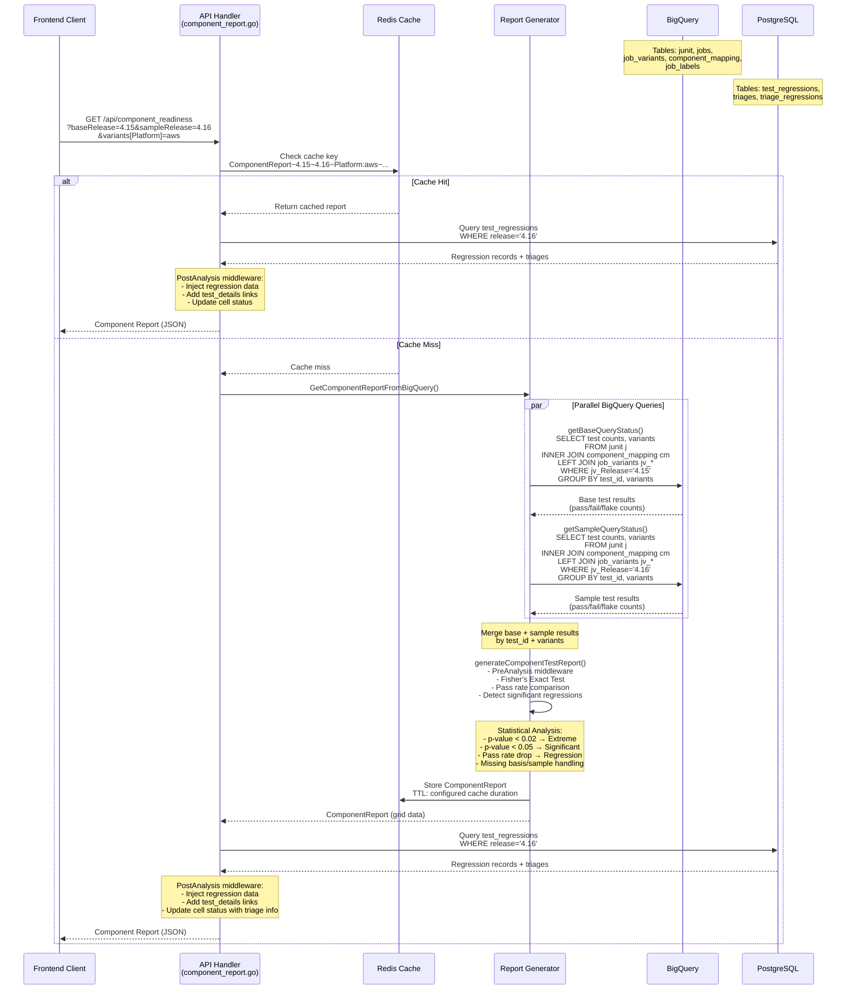
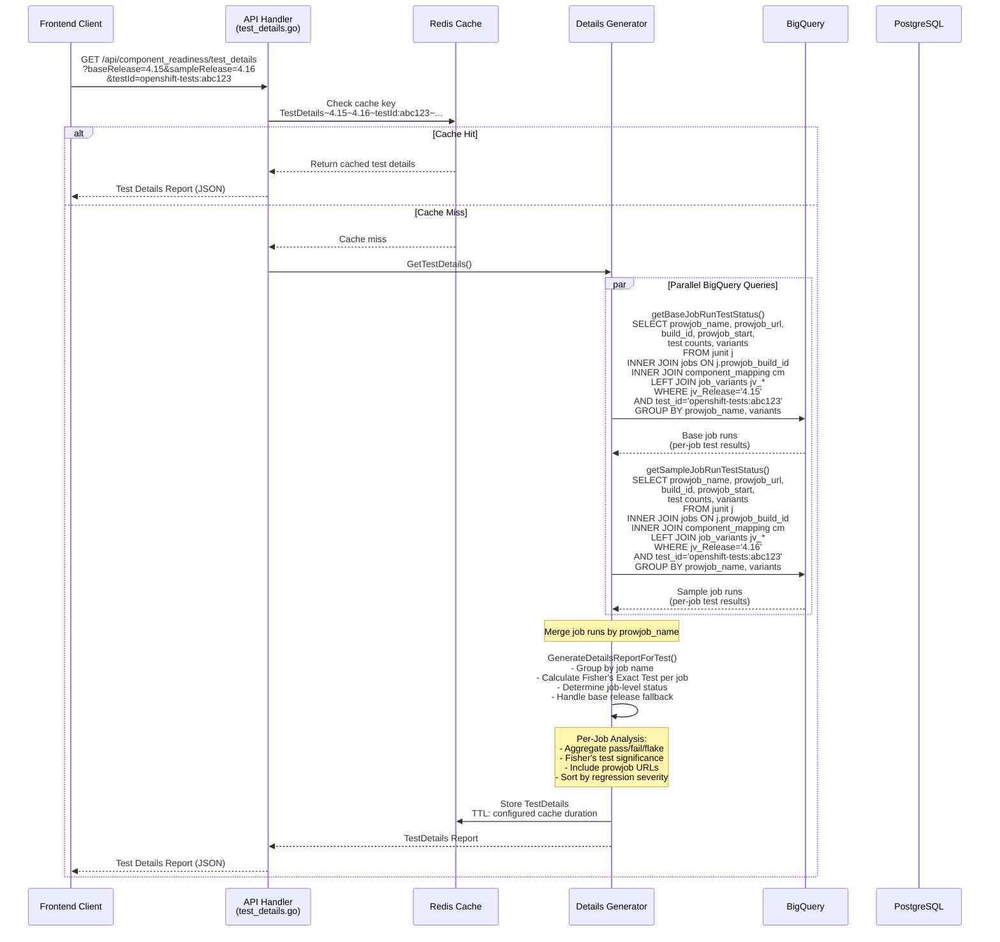
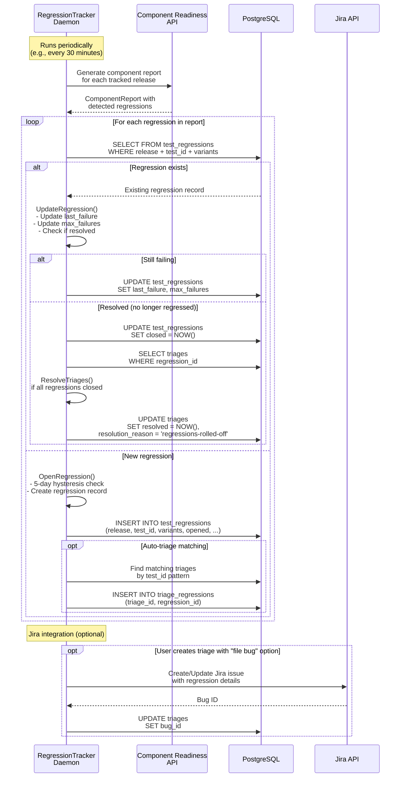
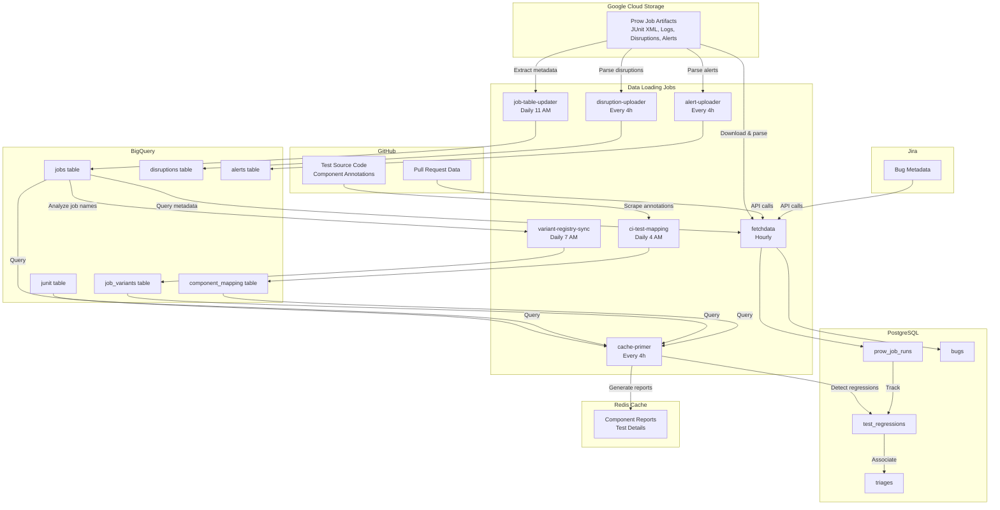
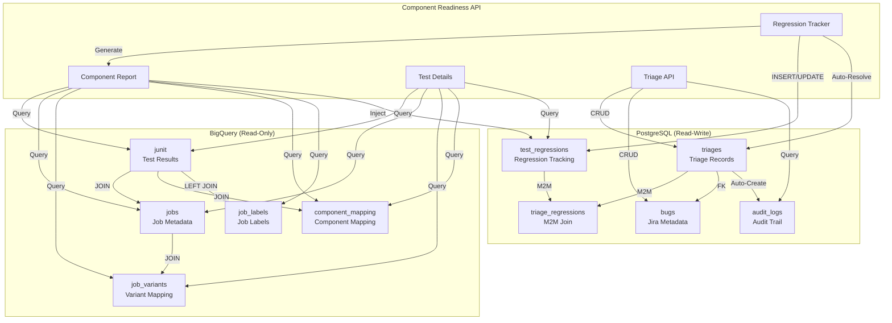
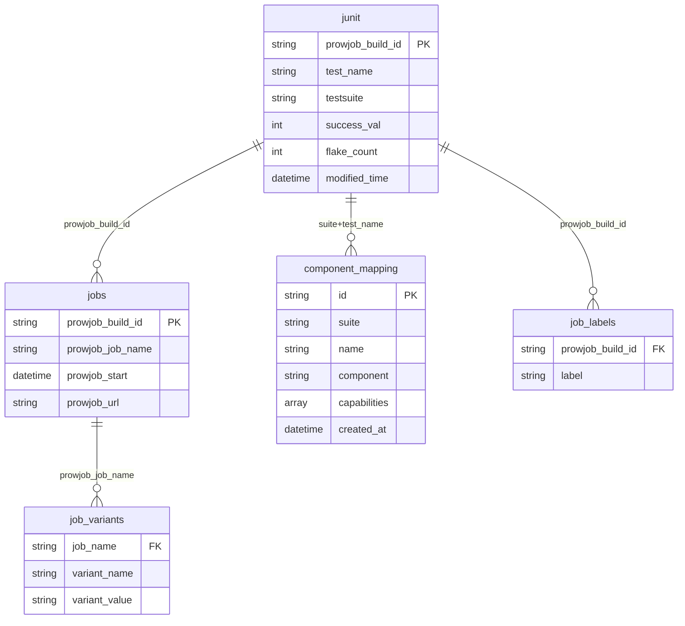
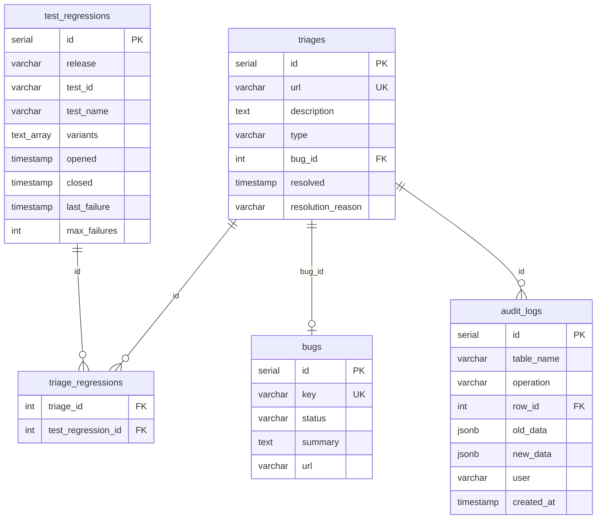

# Component Readiness: Complete System Documentation

This document provides comprehensive documentation of the component readiness system, including data flows, database schemas, queries, and implementation details.

## Overview

Component Readiness is a statistical analysis system that:
- Compares test pass rates between OpenShift releases (base vs. sample)
- Detects statistically significant regressions using Fisher's Exact Test
- Tracks regressions and associates them with bug triages
- Provides drill-down capabilities from component-level to job-level analysis

**Data Sources:**
- **BigQuery**: Historical test execution data and metadata (read-only)
- **PostgreSQL**: Regression tracking, triage management, and audit logs (read-write)
- **Redis Cache**: Query result caching (1-4 hour TTL)

---

## Sequence Diagram: Component Report Generation



---

## Sequence Diagram: Test Details Drill-Down



---

## Sequence Diagram: Regression Tracking Flow



---

## BigQuery Data Sources

### Configuration
**File:** `pkg/flags/bigquery.go:27-31`

**Primary BigQuery Project:**
- **Project:** `openshift-gce-devel` (configurable via `--bigquery-project`)
- **Datasets:**
  - `ci_analysis_us` (default, OCP Engineering CI data)
  - `ci_analysis_qe` (QE CI data, used by QE Component Readiness)

**Releases Table (Different Project):**
- **Table:** `openshift-ci-data-analysis.ci_data.Releases`
- **Project:** `openshift-ci-data-analysis` (different from main project)
- **Dataset:** `ci_data` (contains release metadata)

**BigQuery Architecture:**

Component Readiness queries data from **two different BigQuery projects**:

1. **`openshift-gce-devel`** (Sippy's main project)
   - `ci_analysis_us` dataset - OCP Engineering CI test results (junit, jobs, job_variants, component_mapping, job_labels)
   - `ci_analysis_qe` dataset - QE CI test results (same schema)
   - Used by: Component Readiness API, cache-primer, variant-registry-sync, fetchdata

2. **`openshift-ci-data-analysis`** (job-run-aggregator's project)
   - `ci_data` dataset - Raw CI job data ingested from GCS (jobs, junit, disruptions, alerts, Releases)
   - Used by: job-table-updater, disruption-uploader, alert-uploader
   - Sippy only queries the `Releases` table from this project

**Data Flow Between Projects:**
```
GCS Artifacts → job-run-aggregator → openshift-ci-data-analysis.ci_data
                                     ↓
                          fetchdata copies to → openshift-gce-devel.ci_analysis_us
                                                 ↓
                                        Component Readiness queries
```

---

### Table 1: `junit`
**Purpose:** Core test case execution results

**File:** `pkg/api/componentreadiness/query/querygenerators.go:50-91`

| Column | Type | Purpose | Used In |
|--------|------|---------|---------|
| `prowjob_build_id` | STRING | Links to jobs table; primary join key | All queries - `querygenerators.go:70` |
| `file_path` | STRING | Test file path | Deduplication logic - `querygenerators.go:54` |
| `test_name` | STRING | Test case name | Test identification, joins with component_mapping - `querygenerators.go:55` |
| `testsuite` | STRING | Test suite identifier | Joins with component_mapping.suite - `querygenerators.go:56` |
| `success_val` | INT | Test success indicator (0=fail, 1=pass) | Pass/fail counting - `querygenerators.go:57-60` |
| `flake_count` | INT | Number of flake occurrences | Flake aggregation - `querygenerators.go:61` |
| `modified_time` | DATETIME | Record timestamp | Time range filtering - `querygenerators.go:75-76` |
| `skipped` | BOOL | Test was skipped | Excludes skipped tests - `querygenerators.go:66` |

**Key Query Pattern:** De-duplication CTE
```sql
-- File: pkg/api/componentreadiness/query/querygenerators.go:50-91
-- Handles:
-- - Test retries (multiple failures) → keep first failure
-- - Duplicate successes (OCPBUGS-16039) → count once
-- - Flake detection → aggregate flake_count
WITH deduped_testcases AS (
  SELECT
    file_path,
    test_name,
    testsuite,
    SUM(CASE WHEN success_val = 1 THEN 1 ELSE 0 END) AS success_count,
    SUM(CASE WHEN success_val = 0 THEN 1 ELSE 0 END) AS failure_count,
    SUM(flake_count) AS flake_count,
    prowjob_build_id
  FROM `{dataset}.junit` j
  LEFT JOIN `{dataset}.job_labels` jl
    ON j.prowjob_build_id = jl.prowjob_build_id
    AND jl.label = 'InfraFailure'
  WHERE j.skipped = false
    AND jl.label IS NULL  -- Exclude infra failures
    AND j.modified_time BETWEEN @From AND @To
  GROUP BY file_path, test_name, testsuite, prowjob_build_id
)
```

---

### Table 2: `jobs`
**Purpose:** Prow job run metadata

**File:** `pkg/api/componentreadiness/query/querygenerators.go:175`

| Column | Type | Purpose | Used In |
|--------|------|---------|---------|
| `prowjob_build_id` | STRING | Primary key, join to junit | All queries - `querygenerators.go:175` |
| `prowjob_job_name` | STRING | Job name for variant lookups | Variant joins - `querygenerators.go:296-304` |
| `prowjob_start` | DATETIME | Job start time | Time filtering - `querygenerators.go:183-185` |
| `prowjob_url` | STRING | Link to job artifacts | Test details - `querygenerators.go:465` |
| `org` | STRING | GitHub organization | PR filtering - `querygenerators.go:100-115` |
| `repo` | STRING | GitHub repository | PR filtering - `querygenerators.go:100-115` |
| `pr_number` | INT | Pull request number | PR filtering - `querygenerators.go:100-115` |
| `pr_sha` | STRING | Pull request SHA | PR filtering - `querygenerators.go:100-115` |
| `prowjob_annotations` | ARRAY<STRING> | Job annotations | PR release name extraction - `querygenerators.go:100-115` |

**Key Query Pattern:** Job Name Resolution for PRs
```sql
-- File: pkg/api/componentreadiness/query/querygenerators.go:100-115
-- Extracts the release job name from presubmit annotations
CASE
  WHEN EXISTS (
    SELECT 1 FROM UNNEST(jobs.prowjob_annotations) AS annotation
    WHERE annotation LIKE 'releaseJobName=%%'
  ) THEN (
    SELECT SPLIT(SPLIT(annotation, 'releaseJobName=')[OFFSET(1)], ',')[SAFE_OFFSET(0)]
    FROM UNNEST(jobs.prowjob_annotations) AS annotation
    WHERE annotation LIKE 'releaseJobName=%%'
    LIMIT 1
  )
  ELSE jobs.prowjob_job_name
END AS variant_registry_job_name
```

---

### Table 3: `job_variants`
**Purpose:** Maps job names to variant configurations

**File:** `pkg/api/componentreadiness/query/querygenerators.go:296-304`

| Column | Type | Purpose | Used In |
|--------|------|---------|---------|
| `job_name` | STRING | Prow job name | Joins with jobs.prowjob_job_name - `querygenerators.go:298` |
| `variant_name` | STRING | Variant category | Dynamic variant columns - `querygenerators.go:299` |
| `variant_value` | STRING | Variant value | Filtering and grouping - `querygenerators.go:156-159` |

**Common Variants:**
- `Platform` (aws, gcp, azure, metal, vsphere, etc.)
- `Architecture` (amd64, arm64, ppc64le, s390x)
- `Network` (ovn, sdn, kuryr)
- `Topology` (ha, single)
- `FeatureSet` (default, techpreview)
- `Upgrade` (upgrade, micro, minor)
- `Suite` (serial, parallel, disruptive)
- `Installer` (ipi, upi)
- `Release` (4.15, 4.16, etc.)

**Key Query Patterns:**

**Dynamic Variant Joins:**
```sql
-- File: pkg/api/componentreadiness/query/querygenerators.go:296-304
-- One LEFT JOIN per variant for dynamic column generation
LEFT JOIN `{dataset}.job_variants` jv_Platform
  ON variant_registry_job_name = jv_Platform.job_name
  AND jv_Platform.variant_name = 'Platform'
LEFT JOIN `{dataset}.job_variants` jv_Architecture
  ON variant_registry_job_name = jv_Architecture.job_name
  AND jv_Architecture.variant_name = 'Architecture'
-- ... (one join per variant)
```

**Variant Enumeration:**
```sql
-- File: pkg/api/componentreadiness/component_report.go:303-354
-- Gets all available variant names and values for UI filters
SELECT variant_name, ARRAY_AGG(DISTINCT variant_value ORDER BY variant_value) AS variant_values
FROM `{dataset}.job_variants`
WHERE variant_value != ""
GROUP BY variant_name
```

---

### Table 4: `component_mapping`
**Purpose:** Maps tests to components and capabilities

**File:** `pkg/api/componentreadiness/query/querygenerators.go:137-158`

| Column | Type | Purpose | Used In |
|--------|------|---------|---------|
| `id` | STRING | Unique test identifier (test_id) | Test identification - `querygenerators.go:145` |
| `suite` | STRING | Test suite, joins with junit.testsuite | Test matching - `querygenerators.go:177` |
| `name` | STRING | Test name, joins with junit.test_name | Test matching - `querygenerators.go:177` |
| `component` | STRING | OpenShift component owning the test | Grouping and filtering - `querygenerators.go:146` |
| `capabilities` | ARRAY<STRING> | Test capabilities | Filtering - `querygenerators.go:208-210, 147` |
| `jira_component` | STRING | Jira component name | UI display - `querygenerators.go:148` |
| `jira_component_id` | STRING | Jira component ID | UI linking - `querygenerators.go:149` |
| `staff_approved_obsolete` | BOOL | Test is obsolete | Exclusion filter - `querygenerators.go:193` |
| `lifecycle` | STRING | Test lifecycle (blocking, informing) | Filtering - `querygenerators.go:211-213` |
| `created_at` | DATETIME | Record creation time | Latest version selection - `querygenerators.go:137-143` |

**Key Query Pattern:** Latest Mapping Version
```sql
-- File: pkg/api/componentreadiness/query/querygenerators.go:137-143
-- Uses MAX(created_at) to get the most recent mapping version
WITH latest_component_mapping AS (
  SELECT * FROM `{dataset}.component_mapping` cm
  WHERE created_at = (
    SELECT MAX(created_at) FROM `{dataset}.component_mapping`
  )
)
```

---

### Table 5: `job_labels`
**Purpose:** Job run labels/annotations for filtering

**File:** `pkg/api/componentreadiness/query/querygenerators.go:85-89`

| Column | Type | Purpose | Used In |
|--------|------|---------|---------|
| `prowjob_build_id` | STRING | Links to junit and jobs | Infra failure filtering - `querygenerators.go:85` |
| `prowjob_start` | DATETIME | Job start time | Partition filtering |
| `label` | STRING | Label name | InfraFailure detection - `querygenerators.go:87` |

**Key Query Pattern:** Infra Failure Exclusion
```sql
-- File: pkg/api/componentreadiness/query/querygenerators.go:85-89
-- Excludes job runs marked as infrastructure failures
LEFT JOIN `{dataset}.job_labels` jl
  ON j.prowjob_build_id = jl.prowjob_build_id
  AND jl.label = 'InfraFailure'
WHERE jl.label IS NULL  -- Exclude infrastructure failures
```

---

### BigQuery Query Types

#### Query Type 1: Component Report (Test Summary)
**File:** `pkg/api/componentreadiness/query/querygenerators.go:316-423`

**Purpose:** Aggregates test pass/fail/flake statistics grouped by component, capability, and variants

**Key Columns Selected:**
- `test_id`, `test_name`, `test_suite`
- `component`, `capabilities`, `jira_component`, `jira_component_id`
- Dynamic variant columns (Platform, Architecture, Network, etc.)
- `total_count`, `success_count`, `flake_count`
- `MAX(modified_time) AS last_failure`

**Grouping:** `test_id` + all variant columns

**Filters:**
- Time range: `prowjob_start BETWEEN @From AND @To`
- Release: `jv_Release.variant_value = @Release`
- Job patterns: `prowjob_job_name LIKE '%periodic%' OR '%release%' OR '%aggregator%'`
- Exclude obsolete: `staff_approved_obsolete = false`
- Optional: capability, lifecycle, variant filters

**Label:** `bqlabel.CRJunitBase` / `bqlabel.CRJunitSample`

---

#### Query Type 2: Test Details (Job-Level Breakdown)
**File:** `pkg/api/componentreadiness/query/querygenerators.go:429-523`

**Purpose:** Detailed test results per job run for drill-down analysis

**Key Columns Selected:**
- Same as Query Type 1, plus:
- `file_path`
- `prowjob_url`
- `prowjob_build_id`
- `prowjob_start`

**Grouping:** `test_id` + variants + `file_path` + `modified_time`

**Ordering:** `modified_time DESC` (most recent first)

**Additional Filter:** `test_id = @TestId`

**Label:** `bqlabel.TDJunitBase` / `bqlabel.TDJunitSample`

---

#### Query Type 3: Variant Enumeration
**File:** `pkg/api/componentreadiness/component_report.go:303-354`

**Purpose:** Get all available variant names and values for UI filters

**Label:** `bqlabel.CRJobVariants`

---

#### Query Type 4: Column Value Enumeration
**File:** `pkg/api/componentreadiness/component_report.go:1138-1159`

**Purpose:** Get unique values for cache validation (last 60 days)

**Query Pattern:**
```sql
SELECT DISTINCT {field} as name
FROM `{dataset}.junit`
WHERE modified_time > DATETIME_SUB(CURRENT_DATETIME(), INTERVAL 60 DAY)
ORDER BY name
```

**Label:** `bqlabel.CRJunitColumnCount`

---

#### Query Type 5: Release Dates
**File:** `pkg/api/componentreadiness/query/releasedates.go:28-44`

**Purpose:** Get GA dates for releases to determine time ranges

**Table:** Configured via `--bigquery-releases-table`

**Columns:** Release name and GA date

---

## PostgreSQL Data Sources

### Table 1: `test_regressions`
**Purpose:** Tracks detected test regressions over time

**File:** `pkg/db/models/triage.go:207-230`

| Column | Type | Purpose | Used In |
|--------|------|---------|---------|
| `id` | SERIAL | Primary key | All queries |
| `release` | VARCHAR | Target release (e.g., 4.16) | Filtering - `triage_queries.go:24,36` |
| `base_release` | VARCHAR | Comparison release (e.g., 4.15) | Metadata |
| `component` | VARCHAR | OpenShift component | Grouping and display |
| `capability` | VARCHAR | Test capability | Grouping and display |
| `test_id` | VARCHAR NOT NULL | Test identifier from BigQuery | Matching - `regressiontracker.go:72` |
| `test_name` | VARCHAR | Human-readable test name | Display - `regressiontracker.go:74` |
| `variants` | TEXT[] | Variant key:value pairs | Filtering - `regressiontracker.go:80-84` |
| `opened` | TIMESTAMP NOT NULL | When regression first detected | Tracking - `regressiontracker.go:75` |
| `closed` | TIMESTAMP NULL | When regression resolved | Status tracking - `regressiontracker.go:398-403` |
| `last_failure` | TIMESTAMP NULL | Most recent failure time | Staleness indicator - `regressiontracker.go:346-350` |
| `max_failures` | INT | Maximum failures seen | Severity indicator - `regressiontracker.go:342-344` |

**Indexes:**
- `idx_test_regression_release` on `release`
- `idx_test_regression_test_name` on `test_name`

**Key Queries:**

**List Open Regressions:**
```go
// File: pkg/db/query/triage_queries.go:18-30
dbc.DB.Model(&models.TestRegression{})
    .Preload("Triages.Bug")
    .Where("test_regressions.release = ?", release)
    .Where("test_regressions.closed IS NULL")
    .Find(&openRegressions)
```

**List Current Regressions (with hysteresis):**
```go
// File: pkg/api/componentreadiness/regressiontracker.go:55-64
dbc.DB.Table(testRegressionsTable)
    .Where("release = ?", release)
    .Where("closed IS NULL OR closed > ?", time.Now().Add(-5*24*time.Hour))
    .Scan(&regressions)
```

**Create Regression:**
```go
// File: pkg/api/componentreadiness/regressiontracker.go:66-98
prs.dbc.DB.Create(&models.TestRegression{
    Release:     release,
    TestID:      testID,
    TestName:    testName,
    Opened:      time.Now(),
    Variants:    variants,
    MaxFailures: failures,
    // ...
})
```

**Update Regression:**
```go
// File: pkg/api/componentreadiness/regressiontracker.go:319-427
// Updates max_failures, last_failure, base_release, component, capability
// Re-opens closed regressions if they regress again
```

---

### Table 2: `triages`
**Purpose:** Triage records linking test failures to bugs

**File:** `pkg/db/models/triage.go:14-60`

| Column | Type | Purpose | Used In |
|--------|------|---------|---------|
| `id` | SERIAL | Primary key | All queries |
| `created_at` | TIMESTAMP | Record creation time | Audit trail |
| `updated_at` | TIMESTAMP | Last update time | Audit trail |
| `url` | VARCHAR NOT NULL | Bug URL (typically Jira) | Unique identifier - `triage.go:91` |
| `description` | TEXT | Triage description | Display |
| `type` | VARCHAR | ci-infra, product-infra, product, test | Categorization |
| `bug_id` | INT NULL | Foreign key to bugs table | Jira metadata - `triage.go:244` |
| `resolved` | TIMESTAMP NULL | When triage resolved | Status - `regressiontracker.go:149` |
| `resolution_reason` | VARCHAR | user, regressions-rolled-off, jira-progression | Audit - `regressiontracker.go:150` |

**Relationships:**
- `Bug` (belongs to) - `pkg/db/models/triage.go:35`
- `Regressions` (many-to-many via triage_regressions) - `pkg/db/models/triage.go:49`

**Key Queries:**

**List Triages:**
```go
// File: pkg/db/query/triage_queries.go:9-16
dbc.DB.Preload("Bug").Preload("Regressions").Find(&triages)
```

**Create Triage:**
```go
// File: pkg/api/componentreadiness/triage.go:73-110
// Transaction includes:
// 1. Find or create bug by URL
// 2. Create triage record
// 3. Link regressions via many-to-many
```

**Update Triage:**
```go
// File: pkg/api/componentreadiness/triage.go:210-283
// Transaction includes:
// 1. Load existing triage
// 2. Update bug association
// 3. Replace regression associations
// 4. Save triage
```

**Auto-Resolve Triages:**
```go
// File: pkg/api/componentreadiness/regressiontracker.go:108-160
// Finds triages where all regressions are closed
// Sets resolved timestamp and resolution_reason
```

---

### Table 3: `triage_regressions`
**Purpose:** Many-to-many join table

**File:** `pkg/db/models/triage.go:49`

| Column | Type | Purpose |
|--------|------|---------|
| `triage_id` | INT | Foreign key to triages |
| `test_regression_id` | INT | Foreign key to test_regressions |

**Cascade Behavior:** `OnDelete:CASCADE` - deleting triage removes associations

**Managed via GORM Association API:**
```go
// File: pkg/api/componentreadiness/triage.go:265
txWithContext.Session(&gorm.Session{SkipHooks: true})
    .Model(&triage)
    .Association("Regressions")
    .Replace(triage.Regressions)
```

---

### Table 4: `audit_logs`
**Purpose:** Audit trail for triage changes

**File:** `pkg/db/models/audit.go:7-16`

| Column | Type | Purpose | Used In |
|--------|------|---------|---------|
| `id` | SERIAL | Primary key | All queries |
| `table_name` | VARCHAR NOT NULL | Always 'triage' | Filtering - `triage.go:568` |
| `operation` | VARCHAR | CREATE, UPDATE, DELETE | Audit display - `triage.go:590-605` |
| `row_id` | INT NOT NULL | Triage ID | Filtering - `triage.go:568` |
| `old_data` | JSONB | Previous state | Diff display - `triage.go:616-666` |
| `new_data` | JSONB | New state | Diff display - `triage.go:616-666` |
| `user` | VARCHAR NOT NULL | User who made change | Audit display |
| `created_at` | TIMESTAMP | When change occurred | Timeline |

**Auto-Created via GORM Hooks:**
- `AfterCreate()` - `pkg/db/models/triage.go:93-112`
- `AfterUpdate()` - `pkg/db/models/triage.go:114-133`
- `AfterDelete()` - `pkg/db/models/triage.go:135-148`

**Key Query:**
```go
// File: pkg/api/componentreadiness/triage.go:565-572
dbc.Where("table_name = 'triage' and row_id = ?", triageID)
    .Order("created_at DESC")
    .Find(&auditLogs)
```

---

### Table 5: `bugs`
**Purpose:** Jira bug metadata

**File:** `pkg/db/models/prow.go:122-140`

| Column | Type | Purpose | Used In |
|--------|------|---------|---------|
| `id` | SERIAL | Primary key | Foreign key from triages |
| `key` | VARCHAR | Jira issue key (e.g., OCPBUGS-12345) | Unique identifier |
| `status` | VARCHAR | Jira issue status | Display |
| `summary` | TEXT | Issue summary | Display |
| `affects_versions` | TEXT[] | Affected versions | Display |
| `fix_versions` | TEXT[] | Fix versions | Display |
| `target_versions` | TEXT[] | Target versions | Display |
| `components` | TEXT[] | Jira components | Display |
| `labels` | TEXT[] | Jira labels | Display |
| `url` | VARCHAR | Issue URL | Linking |

**Key Query:**
```go
// File: pkg/api/componentreadiness/triage.go:91,244
dbc.Where("url = ?", triage.URL).First(&bug)
```

---

## Data Loading Jobs

The component readiness system relies on several automated data loading jobs that populate both BigQuery and PostgreSQL databases. These jobs are configured as Kubernetes CronJobs in the `continuous-release-jobs` repository.

### Overview

**Data Flow:**
1. **CI Job Results** → BigQuery (via job-run-aggregator) → PostgreSQL (via Sippy loaders)
2. **Component Mappings** → GitHub → BigQuery (via ci-test-mapping)
3. **Job Variants** → BigQuery (via variant-registry-sync)
4. **Cache Warming** → Redis (via cache-primer)
5. **Regression Tracking** → PostgreSQL (via regression-tracker)

**BigQuery Projects & Datasets Used:**

| Job | BigQuery Project | Dataset(s) | Tables |
|-----|------------------|------------|--------|
| job-table-updater | `openshift-ci-data-analysis` | `ci_data` | jobs, junit |
| disruption-uploader | `openshift-ci-data-analysis` | `ci_data` | disruptions |
| alert-uploader | `openshift-ci-data-analysis` | `ci_data` | alerts |
| ci-test-mapping | `openshift-gce-devel` | `ci_analysis_us` | component_mapping |
| variant-registry-sync | `openshift-gce-devel` | `ci_analysis_us`, `ci_analysis_qe` | job_variants |
| fetchdata | `openshift-gce-devel` | `ci_analysis_us` | (writes to PostgreSQL) |
| cache-primer | `openshift-gce-devel` | `ci_analysis_us` | junit, jobs, job_variants, component_mapping |
| Component Readiness API | `openshift-gce-devel` | `ci_analysis_us` or `ci_analysis_qe` | junit, jobs, job_variants, component_mapping, job_labels |
| Release metadata | `openshift-ci-data-analysis` | `ci_data` | Releases |

---

### Job 1: `fetchdata`
**File:** `continuous-release-jobs/config/clusters/dpcr/services/sippy/fetchdata-cronjob.yaml`

**Schedule:** Every hour (`0 * * * *`)

**Command:**
```bash
sippy load --init-database --mode=ocp --config=/config/openshift.yaml \
  --arch=amd64 --arch=arm64 --arch=multi --arch=s390x --arch=ppc64le
```

**Loaders Enabled:** (default from `cmd/sippy/load.go:101`)
- `prow` - Prow job runs and test results
- `releases` - Release metadata
- `jira` - Jira bug metadata
- `github` - GitHub PR data
- `bugs` - Bug-to-test associations
- `test-mapping` - Component ownership mappings
- `feature-gates` - Feature gate configurations

**Data Sources:**
- **From:** BigQuery (`ci_analysis_us` dataset), GCS (Prow artifacts), GitHub API, Jira API
- **To:** PostgreSQL tables (prow_job_runs, prow_pull_requests, bugs, etc.)

**Purpose:**
- Primary data loader that syncs CI job runs from BigQuery into PostgreSQL
- Downloads and parses Prow job artifacts from GCS (junit XML, build logs)
- Associates tests with components via component_mapping
- Links bugs to affected tests
- Refreshes PostgreSQL materialized views for performance

**Key Code:** `pkg/dataloader/prowloader/prowloader.go`, `cmd/sippy/load.go:211-222`

---

### Job 2: `ci-test-mapping`
**File:** `continuous-release-jobs/config/clusters/dpcr/services/sippy/cronjob-ci-test-mapping.yaml`

**Schedule:** Daily at 4 AM (`0 4 * * *`)

**Command:**
```bash
/hack/cronjob-update-mapping.sh
```

**Data Sources:**
- **From:** GitHub repositories (openshift/origin, openshift/kubernetes, etc.)
- **To:** BigQuery `component_mapping` table

**Purpose:**
- Scrapes test source code from OpenShift repos to extract test metadata
- Identifies test ownership (component, capabilities, Jira component)
- Updates the `component_mapping` table in BigQuery with latest test definitions
- Used by Component Readiness to group tests by component/capability

**Implementation:** Parses test files looking for annotations like:
```go
// Component: Networking
// Capability: Connectivity
// JiraComponent: Networking / ovn-kubernetes
```

**Key Code:** `pkg/dataloader/testownershiploader/testownershiploader.go`

**Table Updated:**
| Column | Example Value |
|--------|---------------|
| `id` | `openshift-tests:abc123def456` |
| `suite` | `openshift-tests` |
| `name` | `[sig-network] Services should provide secure connectivity` |
| `component` | `Networking` |
| `capabilities` | `["Connectivity", "LoadBalancing"]` |
| `jira_component` | `Networking / ovn-kubernetes` |
| `created_at` | `2026-02-11 04:00:00` |

---

### Job 3: `variant-registry-sync`
**File:** `continuous-release-jobs/config/clusters/dpcr/services/sippy/variant-registry-cronjob.yaml`

**Schedule:** Daily at 7 AM (`0 7 * * *`)

**Command:**
```bash
# OCP Engineering Variants
sippy variants generate --bigquery-dataset ci_analysis_us \
  --bigquery-jobs-table jobs --o /tmp/variants.json --config /config/openshift.yaml && \
sippy load --loader job-variants --bigquery-dataset ci_analysis_us \
  --job-variants-input-file /tmp/variants.json

# QE Variants
sippy variants generate --bigquery-dataset ci_analysis_qe \
  --bigquery-jobs-table jobs --o /tmp/qe_variants.json --config /config/openshift.yaml && \
sippy load --loader job-variants --bigquery-dataset ci_analysis_qe \
  --job-variants-input-file /tmp/qe_variants.json
```

**Data Sources:**
- **From:** BigQuery `openshift-gce-devel.ci_analysis_us.jobs` and `openshift-gce-devel.ci_analysis_qe.jobs` tables, variant configuration in `config/openshift.yaml`
- **To:** BigQuery `openshift-gce-devel.ci_analysis_us.job_variants` and `openshift-gce-devel.ci_analysis_qe.job_variants` tables

**Purpose:**
- Analyzes job names to extract variant information (Platform, Architecture, Network, etc.)
- Generates variant mappings for each job based on naming patterns and configuration
- Loads variants into BigQuery `job_variants` table for use by Component Readiness
- Handles both OCP Engineering jobs (ci_analysis_us) and QE jobs (ci_analysis_qe)

**Variant Extraction Examples:**
| Job Name | Extracted Variants |
|----------|-------------------|
| `periodic-ci-openshift-release-master-nightly-4.16-e2e-gcp-ovn` | Platform=gcp, Network=ovn, Release=4.16 |
| `periodic-ci-openshift-release-master-ci-4.16-upgrade-from-stable-4.15-e2e-aws-sdn-upgrade` | Platform=aws, Network=sdn, Release=4.16, Upgrade=upgrade |
| `release-openshift-ocp-installer-e2e-azure-serial-4.16` | Platform=azure, Release=4.16, Suite=serial |

**Key Code:** `pkg/variantregistry/loader.go`, `cmd/sippy/variants.go`

**Table Updated:**
| Column | Example Value |
|--------|---------------|
| `job_name` | `periodic-ci-openshift-release-master-nightly-4.16-e2e-gcp-ovn` |
| `variant_name` | `Platform` |
| `variant_value` | `gcp` |

---

### Job 4: `cache-primer`
**File:** `continuous-release-jobs/config/clusters/dpcr/services/sippy/cache-primer-cronjob.yaml`

**Schedule:** Every 4 hours (`0 */4 * * *`)

**Command:**
```bash
sippy load --init-database --views=/config/views.yaml \
  --loader=component-readiness-cache \
  --loader=regression-tracker \
  --enable-persistent-cache \
  --enable-persistent-cache-write \
  --force-persistent-cache-lookup=true \
  --persistent-cache-duration-max=48h \
  --log-level=debug
```

**Data Sources:**
- **From:** BigQuery (junit, jobs, job_variants, component_mapping)
- **To:** Redis cache (cached query results)

**Purpose:**
- Pre-generates and caches Component Readiness reports for all configured views
- Warms the Redis cache before user requests to avoid expensive BigQuery queries
- Runs regression tracker to detect and track new regressions
- Reduces average API response time from 30-120s to <100ms (cache hit)
- Uses persistent cache to survive application restarts

**Views Cached:**
- Configured in `/config/views.yaml`
- Typically includes all active OpenShift releases (e.g., 4.14, 4.15, 4.16, 4.17)
- Multiple variant combinations per release

**Resource Usage:** 6GB memory request (BigQuery result processing)

**Key Code:** `pkg/dataloader/crcacheloader/crcacheloader.go`, `pkg/api/componentreadiness/regressiontracker.go`

**Cache Keys Generated:**
```
ComponentReport~4.15~4.16~Platform:aws~...
ComponentReport~4.15~4.16~Platform:gcp~...
ComponentReport~4.15~4.16~Platform:azure~...
... (hundreds of permutations)
```

---

### Job 5: `jira-automator`
**File:** `continuous-release-jobs/config/clusters/dpcr/services/sippy/cronjob-automate-jira.yaml`

**Schedule:** Daily at 5 AM (`0 5 * * *`)

**Command:**
```bash
sippy automate-jira --views=/config/views.yaml \
  --jira-account=openshift-trt-privileged \
  --jira-endpoint=https://issues.redhat.com \
  --jira-bearer-token-file=/etc/jira/token \
  --sippy-url=https://sippy.dptools.openshift.org/ \
  --include-components=Test Framework,Unknown \
  --dry-run=true
```

**Data Sources:**
- **From:** PostgreSQL (test_regressions, triages)
- **To:** Jira API (creates/updates Jira issues)

**Purpose:**
- Automatically creates Jira tickets for detected test regressions
- Links regressions to existing bugs when patterns match
- Updates Jira tickets with latest regression status
- Helps engineering teams track and triage test failures

**Status:** Currently running in dry-run mode (`--dry-run=true`)

**Key Code:** `cmd/sippy/automate_jira.go`

---

### Job 6: `never-stable-update`
**File:** `continuous-release-jobs/config/clusters/dpcr/services/sippy/cronjob-never-stable-update.yaml`

**Schedule:** Daily at 4:30 AM (`30 4 * * *`)

**Status:** **SUSPENDED** (`suspend: true`)

**Command:**
```bash
git clone https://github.com/openshift/sippy.git /tmp/sippy
cd /tmp/sippy
./scripts/cronjob-update-neverstable.sh
```

**Purpose:**
- Updates list of tests that are never stable (always fail or flake)
- Creates PRs to mark tests as never-stable in test metadata
- Helps filter out known-bad tests from regression analysis

**Key Code:** `scripts/cronjob-update-neverstable.sh`

---

### Job 7: `job-table-updater`
**File:** `continuous-release-jobs/config/clusters/dpcr/services/dpcr-ci-job-aggregation/job-table-updater-cronjob.yaml`

**Schedule:** Daily at 11 AM (`0 11 * * *`)

**Command:**
```bash
job-run-aggregator prime-job-table \
  --bigquery-dataset ci_data \
  --google-service-account-credential-file=/secret/google-serviceaccount-token/google-serviceaccount-credentials.json
```

**Data Sources:**
- **From:** GCS (Prow job artifacts in gs://origin-ci-test, gs://test-platform-results)
- **To:** BigQuery `openshift-ci-data-analysis.ci_data.jobs` table (note: different project than Sippy queries)

**Purpose:**
- Primary data ingestion job for CI job metadata
- Scans GCS buckets for new Prow job runs
- Extracts job metadata (job name, start time, URL, build ID, PR info)
- Populates the `jobs` table that Sippy queries

**Tool:** `job-run-aggregator` (separate repository: https://github.com/openshift/ci-tools)

**Table Updated:**
| Column | Source |
|--------|--------|
| `prowjob_build_id` | GCS path (e.g., `1234567890`) |
| `prowjob_job_name` | Job name from metadata |
| `prowjob_start` | Job start timestamp |
| `prowjob_url` | Link to Prow job page |
| `org`, `repo`, `pr_number` | GitHub PR info |

---

### Job 8: `disruption-uploader`
**File:** `continuous-release-jobs/config/clusters/dpcr/services/dpcr-ci-job-aggregation/disruption-cronjob.yaml`

**Schedule:** Every 4 hours (`0 */4 * * *`)

**Command:**
```bash
job-run-aggregator upload-disruptions \
  --google-service-account-credential-file=/secret/google-serviceaccount-token/google-serviceaccount-credentials.json
```

**Data Sources:**
- **From:** GCS (Prow job artifacts - disruption JSON files)
- **To:** BigQuery `openshift-ci-data-analysis.ci_data.disruptions` table

**Purpose:**
- Uploads API server disruption data from e2e tests
- Tracks API availability and downtime during upgrades and testing
- Used for reliability analysis and regression detection

**Disruption Data Format:**
```json
{
  "name": "kube-api-new-connections",
  "backend": "kube-apiserver",
  "disruptedDuration": "2.5s",
  "connectionEstablishedDuration": "1.2s"
}
```

**Tool:** `job-run-aggregator`

---

### Job 9: `alert-uploader`
**File:** `continuous-release-jobs/config/clusters/dpcr/services/dpcr-ci-job-aggregation/alert-cronjob.yaml`

**Schedule:** Every 4 hours (`0 */4 * * *`)

**Command:**
```bash
job-run-aggregator upload-alerts \
  --google-service-account-credential-file=/secret/google-serviceaccount-token/google-serviceaccount-credentials.json
```

**Data Sources:**
- **From:** GCS (Prow job artifacts - alert JSON files)
- **To:** BigQuery `openshift-ci-data-analysis.ci_data.alerts` table

**Purpose:**
- Uploads Prometheus alerts fired during test runs
- Tracks which alerts are triggered in CI jobs
- Used for identifying noisy or broken alerts

**Alert Data Format:**
```json
{
  "alertName": "PodCrashLooping",
  "severity": "warning",
  "namespace": "openshift-console",
  "pod": "console-7d8f5c8f4-abc12"
}
```

**Tool:** `job-run-aggregator`

---

## Data Loading Flow Diagram



---

## Data Flow Diagram



---

## Data Relationships

### BigQuery Relationships



### PostgreSQL Relationships



---

## Key Data Patterns

### 1. Variant Storage

**BigQuery:**
- Stored as separate columns via dynamic joins
- Example: `jv_Platform.variant_value AS variant_Platform`
- Allows flexible GROUP BY and filtering

**PostgreSQL:**
- Stored as text array
- Format: `["Architecture:amd64", "Network:OVN"]`
- Enables exact matching for regression tracking

### 2. Time Windows

**BigQuery:**
- Uses `prowjob_start` for time-based filtering
- Typically 7-14 days for base, 3-7 days for sample
- Configurable via relative date ranges

**PostgreSQL:**
- Uses `opened`, `closed`, `last_failure` timestamps
- 5-day hysteresis window for regression reuse
- `last_failure` indicates staleness

### 3. Test Identification

**Cross-System:**
- `test_id` is the primary key linking BigQuery component_mapping to PostgreSQL test_regressions
- Format: `{suite}:{test_name_hash}` or custom ID
- Examples:
  - `openshift-tests:abc123def456`
  - `e2e-aws:789ghi012`

### 4. Deduplication

**BigQuery:**
- CTE `deduped_testcases` handles:
  - Test retries (multiple failures) → keep first
  - Duplicate successes (OCPBUGS-16039) → count once
  - Flake aggregation → SUM(flake_count)
- Group by: file_path, test_name, testsuite, prowjob_build_id

**PostgreSQL:**
- Unique constraint: (release, test_id, variants)
- Prevents duplicate regression records
- Reuses closed regressions within 5-day window

### 5. Regression Hysteresis

**Purpose:** Prevents regression flapping

**Implementation:**
```go
// File: pkg/api/componentreadiness/regressiontracker.go:55-64
regressionHysteresisDays := 5 * 24 * time.Hour

// Include recently closed regressions
WHERE closed IS NULL OR closed > NOW() - @HysteresisDays
```

**Effect:**
- Closed regressions can be re-opened without creating new records
- Avoids noise from intermittent test failures
- Preserves triage associations

---

## Statistical Analysis: Fisher's Exact Test

Component readiness uses Fisher's Exact Test to determine if the difference between base and sample pass rates is statistically significant.

### Contingency Table

```
                Pass    Fail    Total
Base:           a       b       a+b
Sample:         c       d       c+d
Total:          a+c     b+d     n

p-value = hypergeometric probability (two-tailed)
```

### Status Rules

- **p < 0.02** → "Extreme" regression (red)
- **p < 0.05** → "Significant" regression (yellow)
- **Pass rate drop** (new test, no statistical power) → "Regression"
- **Pass rate improvement** → "Improvement" (green)

### Implementation
**File:** `pkg/api/componentreadiness/componentreport/component_report.go`

The Fisher's Exact Test is computed during the PreAnalysis middleware phase, which runs inside the cache. This ensures that expensive statistical calculations are cached and reused.

---

## Cache Strategy

### Cache Keys

```
ComponentReport~{base_release}~{sample_release}~{variants}~{filters}~{config_version}
TestDetails~{base_release}~{sample_release}~{test_id}~{variants}~{config_version}
Variants~{release}~{config_version}
```

### Cache Behavior

**PreAnalysis Middleware:** Runs inside cache
- Statistical analysis (Fisher's Exact Test)
- Pass rate calculations
- Test aggregation
- Variant grouping

**PostAnalysis Middleware:** Runs outside cache
- Regression data injection (from PostgreSQL)
- Triage matching and status updates
- Test detail link generation

### Cache TTL
- Configurable per deployment (typically 1-4 hours)
- Balances freshness vs. BigQuery query costs

### Persistent Cache
- When enabled via `--enable-persistent-caching`
- Survives application restarts
- Decorated via `f.CacheFlags.DecorateBiqQueryClientWithPersistentCache()`

---

## Performance Considerations

### BigQuery

| Pattern | Purpose | Impact |
|---------|---------|--------|
| Partition pruning | Filter by `prowjob_start` and `modified_time` | 10-100x speedup |
| Latest component_mapping CTE | Avoid scanning all versions | 5-10x speedup |
| Deduplication CTE | Single-pass aggregation | Correct results |
| LEFT JOIN on job_labels | Exclude InfraFailure | Filter before join |
| Persistent cache | Reuse query results across runs | 1000x speedup on cache hit |

**Typical Query Time:** 30 seconds - 2 minutes (varies by release size)

### PostgreSQL

| Pattern | Purpose | Impact |
|---------|---------|--------|
| Index on `release` | Fast filtering for release-specific regressions | 100x speedup |
| Index on `test_name` | Fuzzy matching for triage suggestions | 10x speedup |
| GORM Preload | Avoid N+1 queries for associations | 10-100x speedup |
| Transactions | Ensure consistency for triage updates | Correctness |
| Cascade deletes | Automatic cleanup of associations | Simplicity |

**Typical Query Time:** < 100ms for regression/triage queries

---

## Frontend Integration

The frontend (`sippy-ng`) consumes these APIs:

### 1. Component Report Grid (`/component_readiness`)
- Displays component × capability matrix
- Color-coded cells:
  - **Red:** Extreme regression (p < 0.02)
  - **Yellow:** Significant regression (p < 0.05)
  - **Green:** Passing or improved
- Click cell → drill down to test_details

### 2. Test Details (`/component_readiness/test_details`)
- Shows per-job test results
- Links to Prow job artifacts
- Displays regression status and triages
- Grouped by job name with statistical analysis

### 3. Triage Management
- Create/edit triages
- Associate with regressions
- File Jira bugs
- View audit history
- Auto-resolution when all regressions close

---

## Code Reference Index

### BigQuery Queries

| Query Type | File | Lines | Purpose |
|------------|------|-------|---------|
| Dedup CTE | `pkg/api/componentreadiness/query/querygenerators.go` | 50-91 | De-duplicate junit results |
| Latest mapping CTE | `pkg/api/componentreadiness/query/querygenerators.go` | 137-143 | Get latest component_mapping |
| Component report | `pkg/api/componentreadiness/query/querygenerators.go` | 316-423 | Aggregate test stats |
| Test details | `pkg/api/componentreadiness/query/querygenerators.go` | 429-523 | Job-level breakdown |
| Job variants | `pkg/api/componentreadiness/component_report.go` | 303-354 | Variant enumeration |
| Release dates | `pkg/api/componentreadiness/query/releasedates.go` | 28-44 | GA date lookup |

### PostgreSQL Queries

| Operation | File | Lines | Purpose |
|-----------|------|-------|---------|
| List triages | `pkg/db/query/triage_queries.go` | 9-16 | Get all triages |
| List regressions | `pkg/db/query/triage_queries.go` | 32-45 | Get regressions by release |
| List open regressions | `pkg/db/query/triage_queries.go` | 18-30 | Get active regressions |
| Create triage | `pkg/api/componentreadiness/triage.go` | 73-110 | New triage record |
| Update triage | `pkg/api/componentreadiness/triage.go` | 210-283 | Update triage + associations |
| Delete triage | `pkg/api/componentreadiness/triage.go` | 285-292 | Remove triage |
| Open regression | `pkg/api/componentreadiness/regressiontracker.go` | 66-98 | Create regression record |
| Update regression | `pkg/api/componentreadiness/regressiontracker.go` | 319-427 | Update regression stats |
| Resolve triages | `pkg/api/componentreadiness/regressiontracker.go` | 108-160 | Auto-resolve when fixed |
| Audit logs | `pkg/api/componentreadiness/triage.go` | 565-572 | Get change history |

### Model Definitions

| Model | File | Lines | Purpose |
|-------|------|-------|---------|
| TestRegression | `pkg/db/models/triage.go` | 207-230 | Regression record |
| Triage | `pkg/db/models/triage.go` | 14-60 | Triage record |
| Bug | `pkg/db/models/prow.go` | 122-140 | Jira bug metadata |
| AuditLog | `pkg/db/models/audit.go` | 7-16 | Audit trail |

### GORM Hooks

| Hook | File | Lines | Purpose |
|------|------|-------|---------|
| BeforeUpdate | `pkg/db/models/triage.go` | 77-91 | Capture old state |
| BeforeDelete | `pkg/db/models/triage.go` | 62-75 | Capture old state |
| AfterCreate | `pkg/db/models/triage.go` | 93-112 | Create audit log |
| AfterUpdate | `pkg/db/models/triage.go` | 114-133 | Create audit log |
| AfterDelete | `pkg/db/models/triage.go` | 135-148 | Create audit log |

---

## Summary

### BigQuery Usage
- **5 tables:** junit, jobs, job_variants, component_mapping, job_labels
- **5 query types:** component report, test details, variants, column values, release dates
- **Read-only:** All queries are SELECT statements
- **Key pattern:** Dynamic variant joins with de-duplication

### PostgreSQL Usage
- **5 tables:** test_regressions, triages, triage_regressions, bugs, audit_logs
- **10+ query patterns:** CRUD operations on triages and regressions
- **Read-write:** Full CRUD support with audit logging
- **Key pattern:** Many-to-many relationships with automatic audit trail

### Cross-System Integration
- **test_id** links BigQuery component_mapping to PostgreSQL test_regressions
- **PostAnalysis middleware** injects PostgreSQL data into BigQuery results
- **Regression tracker** uses BigQuery reports to update PostgreSQL regressions
- **Cache layer** separates statistical analysis (cached) from dynamic data (not cached)

### Key Metrics
- **BigQuery Query Time**: 30 seconds - 2 minutes
- **Cache Hit Response**: < 100ms
- **Cache TTL**: 1-4 hours
- **Regression Detection Latency**: 30 minutes (daemon interval)
- **Hysteresis Period**: 5 days (prevents flapping)
- **Statistical Confidence**: p < 0.05 threshold (95% confidence)
