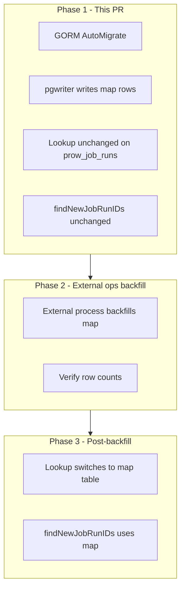

# TRT-2709: Job Run ID Mapping Table Plan

**JIRA:** TRT-2709
**Branch:** `trt-2709-jobrunid-mapping`

## Problem

APIs, URLs, BigQuery, and triage all identify job runs by **Prow build ID** (`prow_job_runs.id`). Phase 4b will partition `prow_job_runs` by `(prow_job_release, timestamp)` with a composite PK. After that, a lookup by `id` alone cannot partition-prune.

Today, `LookupProwJobRunPartitionKeys` in `pkg/db/query/job_queries.go` scans `prow_job_runs` directly:

```go
func LookupProwJobRunPartitionKeys(gormDB *gorm.DB, jobRunID int64) (ProwJobRunPartitionKeys, error) {
	var keys ProwJobRunPartitionKeys
	err := gormDB.Table("prow_job_runs").
		Select("prow_job_release, timestamp").
		Where("id = ?", jobRunID).
		Take(&keys).Error
	return keys, err
}
```

This works on the current unpartitioned table (~410K rows) but will degrade once `prow_job_runs` is LIST/RANGE partitioned. The comment in that file already calls for a mapping table replacement.

**Callers (5 production paths, no API signature changes needed):**

- `pkg/api/job_runs.go` — `FetchJobRun`
- `pkg/api/jobartifacts/query.go`
- `pkg/api/jobrunscan/reevaluate.go`
- `pkg/db/infrafailure/infrafailure.go`
- `pkg/flags/postgres_benchmarking_test.go` — validation harness



---

## Design

### Table: `prow_job_run_id_map`

| Column | Type | Notes |
|--------|------|-------|
| `id` | `BIGINT PRIMARY KEY` | Prow build ID (same as `prow_job_runs.id`) |
| `prow_job_release` | `TEXT NOT NULL` | Partition key |
| `timestamp` | `TIMESTAMPTZ NOT NULL` | Partition key |

**Properties:**

- **Not partitioned** — single PK index lookup by `id`
- **Tiny rows** — ~24 bytes each
- **No FK to `prow_job_runs`** — application-level integrity (same pattern as phase 4a child tables)
- **Immutable after insert** — release and timestamp for a build ID never change

---

## Phase 1: Pre-backfill implementation (this PR)

**Goal:** Ship the mapping table infrastructure and start populating it on ingest. All read paths keep using `prow_job_runs` until backfill completes in Phase 2.

### What ships

| Item | File(s) | Notes |
|------|---------|-------|
| GORM model + AutoMigrate | `pkg/db/models/prow.go`, `pkg/db/db.go` | `ProwJobRunIDMap` registered in `UpdateSchema` |
| pgwriter insert | `pkg/dataloader/prowloader/pgwriter/pgwriter.go` | Map rows in same txn as `prow_job_runs` |
| Test fixture | `test/integration/util/fixtures.go` | `CreateProwJobRun` syncs map row |
| Tests | `test/integration/pgwriter_test.go` | Verify map row created on pgwriter insert |
| Docs | `pkg/db/PARTITIONS_README.md` or partitioning prep doc | Document phases; reference example backfill SQL below |

### What does NOT change in Phase 1

| Item | Reason |
|------|--------|
| `LookupProwJobRunPartitionKeys` | Map is incomplete until backfill; keep querying `prow_job_runs` |
| `findNewJobRunIDs` | Still anti-joins `prow_job_runs`; map is incomplete until backfill |
| External backfill | Managed outside this repo in Phase 2; example SQL documented below |
| `prow_job_runs` partitioning | Phase 4b, separate effort |

### Phase 1 implementation details

#### Schema (`ProwJobRunIDMap`)

The table is created by GORM `AutoMigrate` in `UpdateSchema` (no golang-migrate file). Equivalent DDL:

```sql
CREATE TABLE prow_job_run_id_map (
    id BIGINT PRIMARY KEY,
    prow_job_release TEXT NOT NULL,
    timestamp TIMESTAMPTZ NOT NULL
);
```

Historical backfill is **not** run during schema setup. An external ops process handles backfill separately in Phase 2 (see example SQL below).

#### pgwriter

In `pkg/dataloader/prowloader/pgwriter/pgwriter.go`, after populating `tmp_prow_job_runs` and before commit:

```sql
INSERT INTO prow_job_run_id_map (id, prow_job_release, timestamp)
SELECT id, prow_job_release, timestamp
FROM tmp_prow_job_runs
ON CONFLICT (id) DO NOTHING;
```

#### Proposed external backfill SQL (example only, not in repo)

Backfill is **not** part of Phase 1 and **no script is added to this repository**. An external ops process owns backfill timing and tooling. The SQL below is a reference example that process may adapt (batching, scheduling, etc.):

```sql
-- Idempotent; safe to re-run.
INSERT INTO prow_job_run_id_map (id, prow_job_release, timestamp)
SELECT id, prow_job_release, timestamp
FROM prow_job_runs
WHERE prow_job_release IS NOT NULL AND prow_job_release <> ''
ON CONFLICT (id) DO NOTHING;
```

#### Tests

| Test | Verifies |
|------|----------|
| pgwriter mapping row | New run via `writeBatch` creates map row |

### Phase 1 verification

`prow_job_run_id_map` is created by GORM `AutoMigrate` in `UpdateSchema` (invoked by `migrate`, `serve`, and integration test setup), not by a golang-migrate SQL file.

```bash
go run ./cmd/sippy migrate --database-dsn "$SIPPY_SEED_DATABASE_DSN"
go run ./cmd/sippy migrate --database-dsn "$SIPPY_PRODLIKE_DATABASE_DSN"
go test ./pkg/db/query/...
make integration
make lint
```

**After Phase 1 deploy (before backfill):**

```sql
-- Map should have only newly ingested runs (small count)
SELECT COUNT(*) FROM prow_job_run_id_map;

-- Lookups still use prow_job_runs; no API behavior change
```

**Do NOT expect map count to match prow_job_runs count yet.**

### Phase 1 risks

| Risk | Mitigation |
|------|------------|
| Map unused for reads until Phase 3 | Expected; prow_job_runs lookup unchanged in Phase 1-2 |
| New run missing from map | pgwriter writes both in same txn |
| Test inserts bypass pgwriter | `CreateProwJobRun` fixture syncs map row |

---

## Phase 2: External backfill (ops, not in repo)

**Goal:** Populate historical rows into `prow_job_run_id_map` without blocking deploy or migrate.

**Prerequisite:** Phase 1 deployed and pgwriter writing new map rows.

**Owner:** External ops process (not maintained in this repository).

### Steps

1. Run backfill against staging, then production using the external process (may use the example SQL in this plan as a starting point)
2. Verify completeness:

```sql
-- Must return 0 before Phase 3
SELECT COUNT(*) FROM prow_job_runs r
LEFT JOIN prow_job_run_id_map m ON m.id = r.id
WHERE m.id IS NULL
  AND r.prow_job_release IS NOT NULL AND r.prow_job_release <> '';
```

3. Spot-check counts:

```sql
SELECT COUNT(*) FROM prow_job_runs;
SELECT COUNT(*) FROM prow_job_run_id_map;
-- should match (minus rows with empty prow_job_release)
```

**No application code changes in Phase 2.** `LookupProwJobRunPartitionKeys` continues querying `prow_job_runs`.

---

## Phase 3: Post-backfill switch (follow-up PR(s))

**Goal:** Move read paths to the map table now that it is complete. Required before phase 4b partitions `prow_job_runs`.

**Prerequisite:** Phase 2 verification query returns 0.

### 3a. Switch `LookupProwJobRunPartitionKeys` (required)

Update `pkg/db/query/job_queries.go` to query `prow_job_run_id_map` only. Remove the "future iteration" TODO comment. No fallback to `prow_job_runs`.

```go
// Query prow_job_run_id_map by id; return gorm.ErrRecordNotFound if missing
```

All callers (`FetchJobRun`, job artifacts, re-evaluator, infrafailure) pick up the change automatically via the shared function.

### 3b. Switch `findNewJobRunIDs` (phase 4b)

Replace anti-join target in `pkg/dataloader/prowloader/prow.go`:

```sql
-- Before (Phase 1-2):
LEFT JOIN prow_job_runs r ON r.id = t.id WHERE r.id IS NULL

-- After (Phase 3):
LEFT JOIN prow_job_run_id_map m ON m.id = t.id WHERE m.id IS NULL
```

Can ship with phase 4b `prow_job_runs` partitioning PR. **Only safe after backfill verified** — map-only before backfill would re-process historical runs.

### Phase 3 also documents

- Retention: when phase 4b drops old `prow_job_runs` partitions, delete corresponding `prow_job_run_id_map` rows in the same operation

---

## Other `prow_job_runs` queries without partition keys (inventory)

Most production queries **already filter on `prow_job_release` and `timestamp`** (job runs report, variant reports, build clusters, autocomplete, test counts, payload queries, etc.). Those are fine for partition pruning once phase 4b lands.

The problem class is **point lookups or writes keyed only by build ID**:

### Already two-step (Phase 3 map fixes step 1)

| Location | Pattern |
|----------|---------|
| `pkg/api/job_runs.go` `FetchJobRun` | `LookupProwJobRunPartitionKeys` → `Take` with release + timestamp |
| `pkg/api/jobartifacts/query.go` `getJobRun` | same |
| `pkg/api/jobrunscan/reevaluate.go` | same |
| `pkg/db/infrafailure/infrafailure.go` `subtractFromSummaries` | lookup → child table scan with partition keys |

### ID-only — Phase 3 (after backfill)

| Location | Query | Phase |
|----------|-------|-------|
| `pkg/db/query/job_queries.go` | `LookupProwJobRunPartitionKeys` | Phase 3 (map only, no fallback) |
| `pkg/dataloader/prowloader/prow.go` `findNewJobRunIDs` | `LEFT JOIN prow_job_runs r ON r.id = t.id` | Phase 3 (after backfill) |

### ID-only — NOT in Phase 1; phase 4b follow-up

| Location | Query | Fix |
|----------|-------|-----|
| `pkg/db/infrafailure/infrafailure.go` `setInfraFailureLabelSQL` | `UPDATE prow_job_runs ... WHERE id = ?` | Map lookup first; add `AND prow_job_release = ? AND timestamp = ?` |
| `pkg/db/infrafailure/infrafailure.go` `SubtractNewInfraFailure` | `SELECT 1 ... WHERE id = ? AND labels @> ...` | Same |
| `pkg/sippyserver/server.go` disruption API | `SELECT MIN/MAX(timestamp) ... WHERE id IN ?` | Query `prow_job_run_id_map` instead |

### JOIN on `id` only, but `WHERE` has partition keys (phase 4b query hardening)

Suboptimal after partitioning; add composite join on release + timestamp (pattern in `pkg/db/query/test_queries.go`):

- `pkg/api/componentreadiness/dataprovider/postgres/provider.go`
- `pkg/api/recent_test_failures.go`
- `pkg/db/query/repository_queries.go`
- `pkg/db/query/pull_request_queries.go`
- `pkg/db/functions.go`

Not mapping-table problems; separate phase 4b query optimization.

**Phase 1 scope:** GORM AutoMigrate + model + pgwriter + pgwriter test + docs. No lookup changes. No backfill script in repo.

---

## Out of scope (all phases)

- Partitioning `prow_job_runs` / annotations / PR join table (phase 4b, separate plan)
- Golden-file validation (`docs/plans/trt-2709-golden-file-validation.md`)
- In-migrate backfill and repo-maintained backfill scripts (external ops owns backfill; example SQL in this plan only)
- BigQuery changes (BQ uses build ID strings independently)
- Infrafailure id-only UPDATE/SELECT, disruption API, composite JOIN hardening (phase 4b; see inventory above)

---

## PR summary

| Phase | Deliverable | When |
|-------|-------------|------|
| **1** | This PR: AutoMigrate + model + pgwriter + pgwriter test + docs | Now |
| **2** | External ops backfill + verification | After Phase 1 deploy |
| **3** | Switch lookup to map + `findNewJobRunIDs` + infrafailure/disruption fixes + composite JOIN hardening | After Phase 2 verified; with phase 4b |
